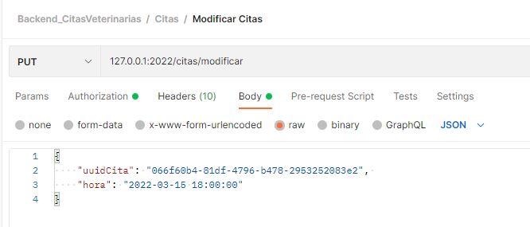

# Backend_CitasVeterianarias

Este proyecto es un proyecto para desarrollar la API para la gestion de citas de una clinica veterinaria. En ella podremos ver las entidades de Usuarios, Mascotas, Veterinarios y dichas Citas.


## Comenzando 🚀

Estas instrucciones te permitirán obtener una copia del proyecto en funcionamiento en tu máquina local para propósitos de desarrollo y pruebas.

### Instalación 🔧

* Clona el repositorio a tu maquina local
```
git clone https://github.com/Rafael3994/Backend_CitasVeterinarias.git
```
* Necesitamos un entorno para trabajar con nuestra base de datos mysql. (En mi caso utilize xampp).
* Instalamos node.js en el ordenador, con ello tambien abremos instalado npm.
* Abrimos el repositiorio clonado con un IDE y ejecutamos el comando de npm.
```
## npm:
npm install 
## yarn:
yarn install
```
* Copia en fichero .env-sample y dejalo con el nombre .env.<br>
Veras que hay variables a las que asignar un valor:
```
## Puerto que utiilzara la aplication.
PORT=
## Clave secreta que servira para encriptar el Jason Web Token.
JWT_SECRET=
```
* En el directorio config, creamos el archivo config.json y añadimos estas lineas.
En ellas ponemos nuestros datos correspondientes para conectarnos a la base de datos.
(En ellas hay tres desplieges, por defecto coge development).
```
{
  "development": {
    "username": "NOMBRE_DE_USUARIO",
    "password": "CONTRASEÑA",
    "database": "NOMBRE_BD",
    "host": "IP_DB",
    "port": "PUERTO_BD",
    "dialect": "mysql"
  },
  "test": {
    "username": "NOMBRE_DE_USUARIO",
    "password": "CONTRASEÑA",
    "database": "NOMBRE_BD",
    "host": "IP_DB",
    "dialect": "mysql"
  },
  "production": {
    "username": "NOMBRE_DE_USUARIO",
    "password": "CONTRASEÑA",
    "database": "NOMBRE_BD",
    "host": "IP_DB",
    "dialect": "mysql"
  }
}
```
* Creamos la BD
```
# npm
npm sequelize-cli db:create
# yarn
yarn sequelize-cli db:create
```
* Subimos las entidades a la BD
```
# npm
npm sequelize-cli db:migrate
# yarn
yarn sequelize-cli db:migrate
```
* Finalmente para iniciar el proyecto ejecuta el comando
```
## npm:
npm start
## yarn:
yarn start
```


## Ejecutando las pruebas ⚙️

Estas son las funcionalidades de esta API:

Usuarios:

* Registra usuarios (POST: /users/register)<br>


* Login de usuario (POST: /users/login)<br>


Los siguentes endpoint requieren de JWT, cuando te logueas con un usuario se creara este.

* Mostrar usuarios (GET: /users) <br>


* Eliminar usuario por UUID (DELETE: /users) <br>


* Mostrar mascotas del Usuario (GET: /users/mascotas) <br>


* Logout (GET: /users/logout) <br>


* Logout All (GET: /users/logoutall) <br>


Mascotas:

* Mostrar mascotas (GET: /mascotas) <br>


* Registrar mascotas (POST: /mascotas/register) <br>


Veterinarios:

* Mostrar veterinarios (GET: /veterinarios) <br>


* Registrar veterinarios (POST: /veterinarios/register) <br>


Citas:

* Mostrar cita (GET: /citas) <br>


* Crear cita (POST: /citas/nueva) <br>


* Eliminar cita (DELETE: /citas) <br>


* Citas pendientes en un determinado dia (POST: /citas/pendientes) <br>


* Modificar una cita (POST: /citas/modificar) <br>



## Construido con 🛠️

* [JavaScript](https://www.javascript.com/) - Lenguaje de programacion
* [Node.js](https://nodejs.org/es/) - Entorno de ejecucion
* [Express](https://expressjs.com/es/) - Framework de node para Backend
* [Mysql](https://www.mysql.com) - Base de datos

## Autores ✒️

* **Rafael Garcia Perez** - [rafael3994](https://github.com/Rafael3994)

## Licencia 📄

Este proyecto está bajo la Licencia.
